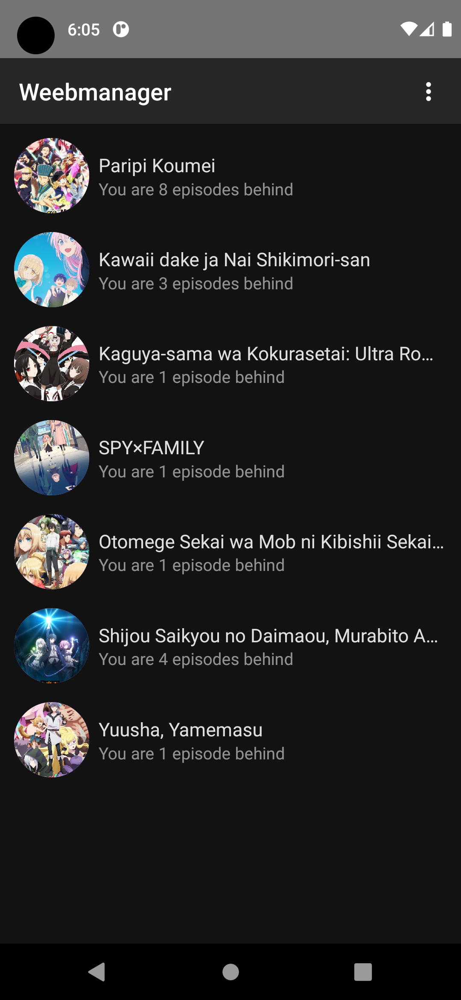
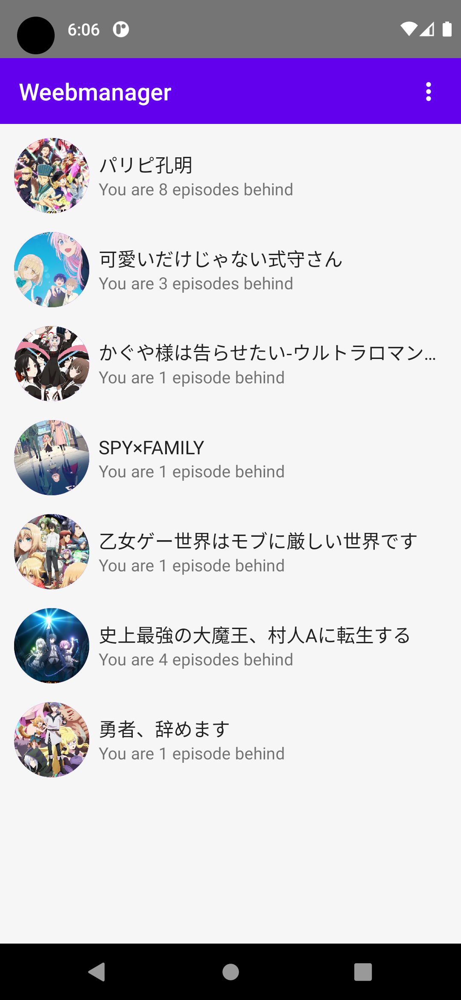
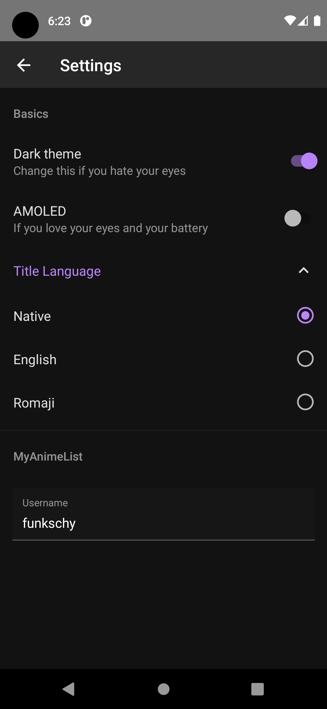

# Weebmanager

A simple app to keep track of the Anime shows you're watching this season.
Weebmanager is written in ClojureScript with the help of react native.

## Installation

Currently only Android is supported. To install the Android app, just download the latest apk file from the releases section.

## Screenshots

