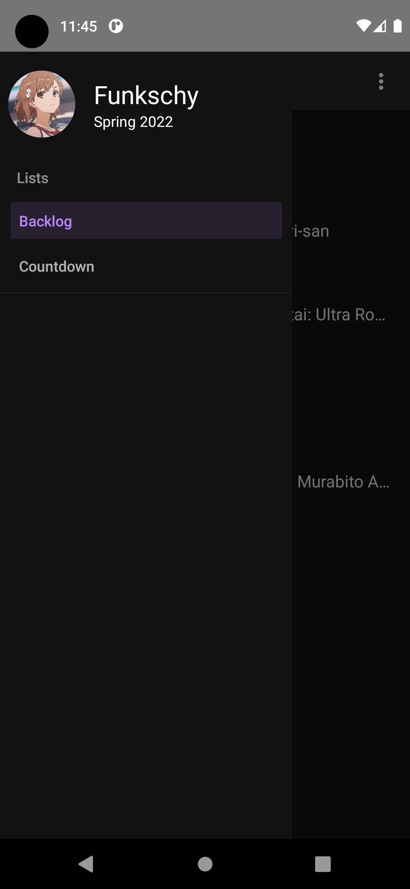
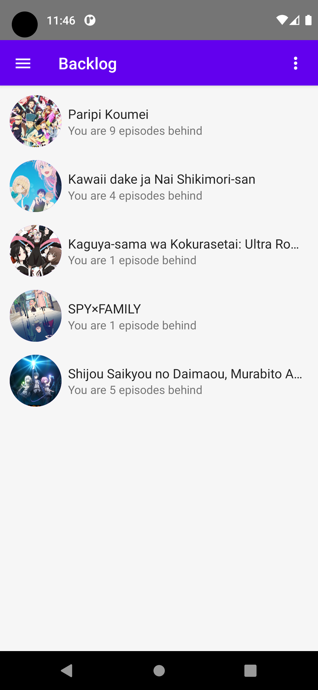
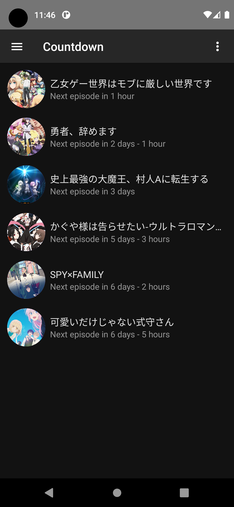

# Weebmanager

A simple app to keep track of the Anime shows you're watching this season.
Weebmanager is written in ClojureScript with the help of react native.

## Installation

Currently only Android is supported. To install the Android app, just download the latest apk file from the releases section.

## Usage

When you use the app for the first time, you'll have to set your myanimelist.net username in the settings. Just press the three dots button
in the top right and enter your name in the username text field. To refresh the animelist, just pull down like in any other app.

To save your settings, you currently have to use the back button in the top left of the settings page. Don't swipe from the side of the screen!
If you use the back button, all your settings will be saved even if you close and reopen the app.

This app will only show you the shows that are set to "Currently Watching" in your MAL account and are airing in the current season.
As soon as the season changes, it will only display the shows from the new season.

## Screenshots

